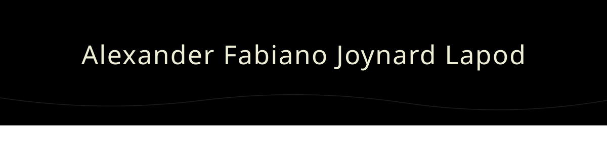

  

**Data Science & AI Specialist | Full-Stack Developer | Assistant Lecturer**

---

<h3 align="center">About Me</h3>

  I am an Informatics Engineering student at <strong>Universitas Surabaya</strong>, specializing in Data Science and Artificial Intelligence. As a <strong>Data Analyst & Software Engineer</strong>, I am deeply passionate about building data-driven solutions, writing clean code, and optimizing AI models.

  <strong>Current Focus</strong>: Researching Melanoma risk detection using Weighted Ensemble CNN and Genetic Algorithm optimization. 
  <strong>Learning Path</strong>: Exploring Python (Data Science), AI-driven solutions, Applied AI, and Modern Full-Stack Development. 
  <strong>Interests</strong>: Data Science & AI, Data Analytics, Software Engineering.

---

<h3 align="center">Current Roles</h3>

  Software Engineer at Koperasi PT. Central Proteina Prima, Tbk. 
  Assistant Lecturer at IF Universitas Surabaya 
  Coordinator of IT Department for MOB FT 2026

---

<h3 align="center">Tech Stack & Tools</h3>

   
   
  

  
  
  
  
  
  
  
  

---

  

    <i>"Data is a precious thing and will last longer than the systems themselves."</i> 
    <strong>— Tim Berners-Lee</strong>
  

  

